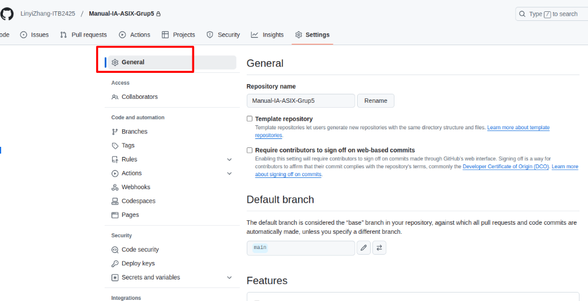
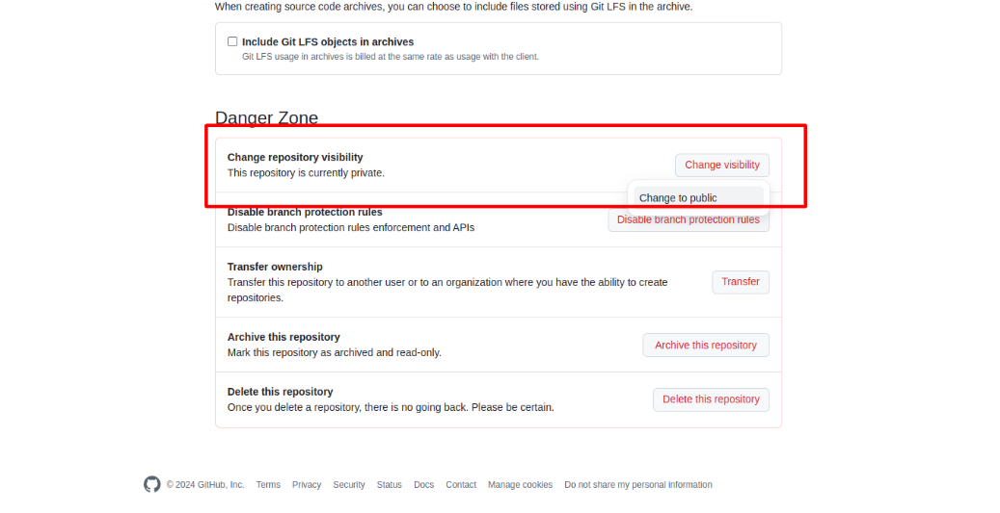
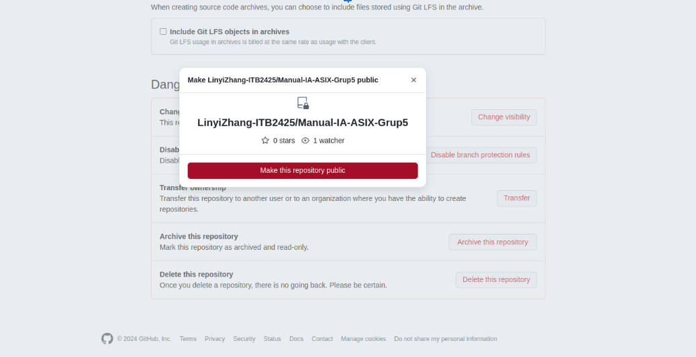

# Manual de GitHub Pages

## Introducción 
GitHub Pages es una herramienta gratuita de GitHub diseñada para que los desarrolladores puedan alojar sitios web estáticos de forma rápida y sencilla, sin incurrir en costos adicionales. Es ideal para diversos usos, como exhibir proyectos personales, crear portafolios, landing pages o blogs, eliminando la necesidad de pagar por hosting o gestionar servidores, lo que la convierte en una opción accesible para desarrolladores de todos los niveles.

---

## Paso 1
Primero nos aseguramos que nuestro repositorio sea público. Lo podemos comprobar desde la configuración del repositorio "General" -> "Change Repository Visibility" y podremos cambiar de privado a público en el caso que no lo esté.

### Paso 2

